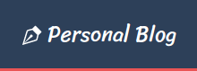
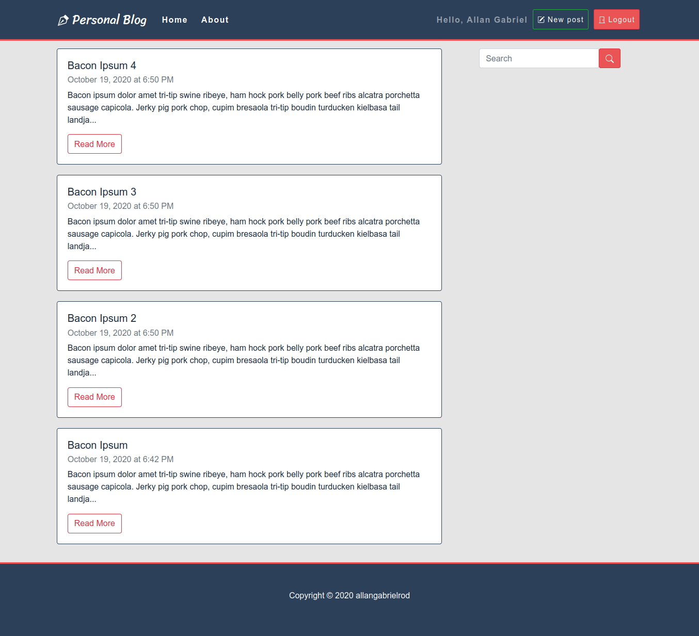
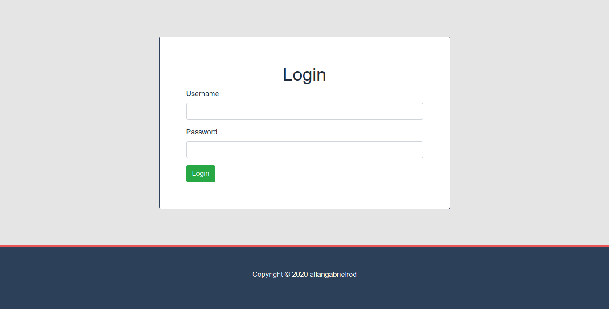
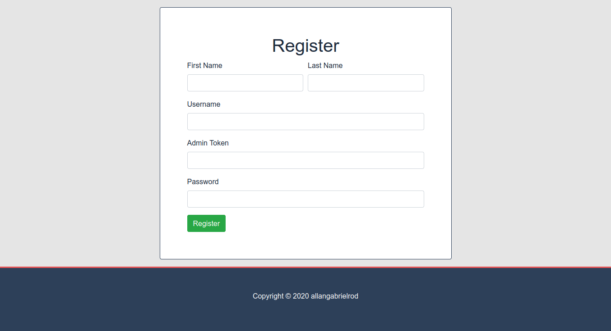
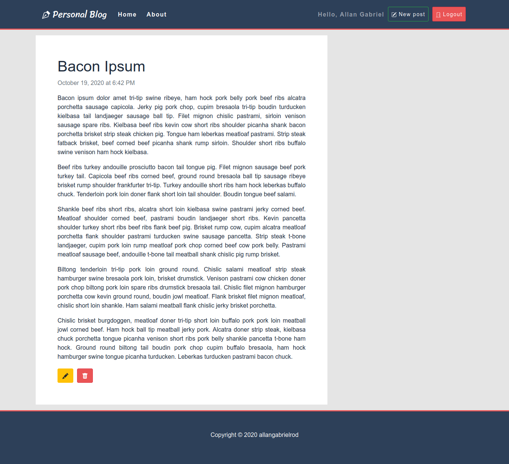
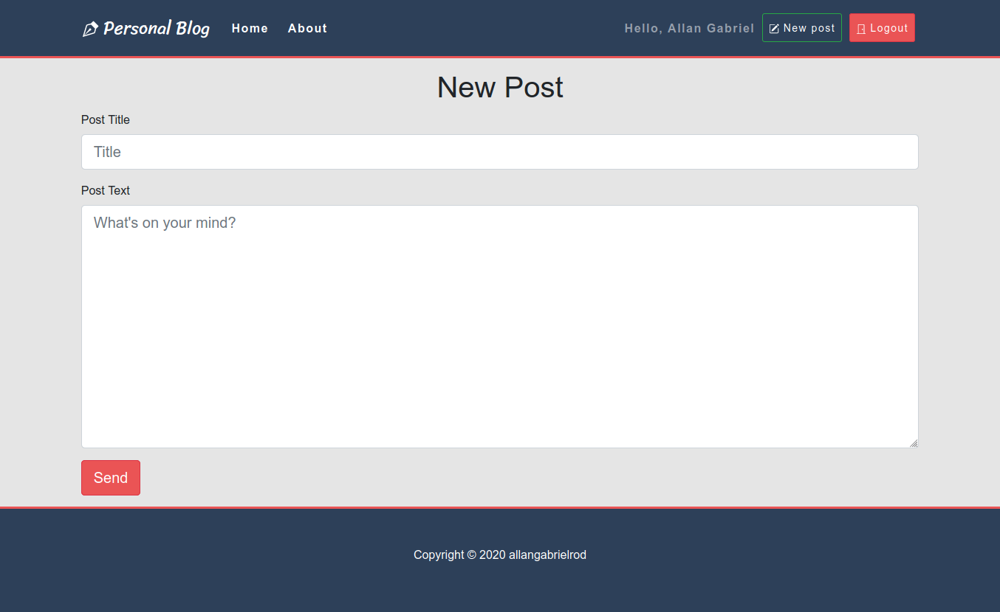

    
    
A simple nodejs personal blog.

# 📷 Screenshots

<h3> Home </h3>

<h3> Login </h3>

<h3> Register </h3>

<h3> Post </h3>

<h3> Compose </h3>

 
 

# 🖋️ Description

Personal blog is a open-source blog platform where you can use, customize, add new features and do whatever you'd like with it. This project was developed and maintained as a code exercise.

# 🛠️ Technologies

- ### [Node.js](https://nodejs.org/en/)
- ### [Express](http://expressjs.com/pt-br/)
- ### [MySQL](https://www.mysql.com/)
- ### [Sequelize](https://sequelize.org)
- ### [Passport.js](http://www.passportjs.org/)
  - [Passport-local](http://www.passportjs.org/packages/passport-local/)
- ### [Client-Sessions](https://www.npmjs.com/package/client-sessions)
- ### [Sanitizer](https://www.npmjs.com/package/client-sessions)
- ### [EJS](https://ejs.co/)
- ### [Bootstrap 4](https://getbootstrap.com/)

# 🚀 How to deploy

<h3>First Steps</h3>

1. Make sure you have [GIT](https://git-scm.com/) installed in your system
2. Make sure you have [Node.js](https://nodejs.org/en/) installed in your system
3. Make sure you have [MySQL](https://www.mysql.com/) installed in your system (You can also use another SQL database, but requires some extra setup)
4. Clone this repository:

   <code>$ git clone https://github.com/allangabrielrod/PersonalBlog-SQL.git</code>

5. Setup the environment variables. (Take a look below)

<h3>Environment Variables</h3>

Before you run this project you must setup the following environment variables. We recommend you to choose between a <code>.env</code> file inside the project root directory or in your system as local variables.

- ### <code> DBURL </code>

  MongoDB URL

- ### <code> PORT </code>

  Network port that the server should listen.

- ### <code> CK_SECRET </code>

  Session cookie secret.

- ### <code> ADMIN_TOKEN </code>

  Application admin token.

- ### <code> DBNAME </code>

  Database name.

- ### <code> DBUSER </code>

  Database user.

- ### <code> DBNAME </code>

  Database name.

- ### <code> DBHOST </code>

  Database host.

- ### <code> DBDIALECT </code>

  Which SQL database you're using.

<h3>.env Example</h3>

<code>

    PORT=3000
    ADMIN_TOKEN=opaksdoaidwpasdfjaisjfpisfi
    CK_SECRET=asjdiajsodihfoiajdfiuashdbfiouadhfao
    DBNAME=personalBlog
    DBUSER=dbuser
    DBPASSWORD=123456
    DBSTORAGE=localhost
    DBDIALECT=mysql

</code>

<h3>Last Steps</h3>

1. After you've got all set up, run the following to download the project dependencies:

   <code>$ npm i </code>

2. After you're done, run the following to run the application:

   <code>$ node app.js </code>

3. Done!

<h3># Using</h3>

1. ### First User

   After deploy, go to the <code>/register</code> route and use your admin token for register a admin user. After it, you can only register new users if you're authenticated as a admin.

2. ### Register Admin

   Go to the <code>/register</code> route as a admin user and use the same admin token as you did before.

3. ### Login
   Go to the <code>/login</code> route and enter your credentials.

# 💁 Extra Tips

If you're a developer and want to make changes to this project, we recommend you to install [nodemon]("https://nodemon.io/") as a node global package. So you can focus on development instead of waste time restarting the application on every change. To install it just run:

<code>$ npm i -g nodemon</code>
